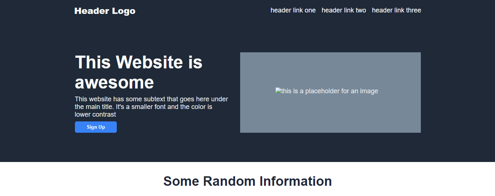

# landing-page

## Description
A recreation of a landing page provided in one of The Odin Project's pages.

## Purpose and Thoughts
The purpose of this project was to make a website from a provided mockup and to try to replicate it
as close to the original design as possible. I made sure to recreate it as close to the original
design, and I can say that I am pleased with the results. 

This project relies heavily and reinforces the concept of Flexbox and how it works. I can confidently say that it makes structuring Web pages an easier task rather than using the default block structure or floats.

The only dowside to it is that sometimes some items may not align the way you want them to, but you can always rely on `margin: 0 auto` spread some of the content around the way you want to.

## How to Run
You can open the index.html file on your Web browser or you can launch it with `Alt+L Alt+O` if you have
the Live Server extension installed MS Visual Studio. This will redirect you to the home page.

Additionally, you can see the live version by clicking [here](https://jonathanbernal.github.io/landing-page/).

## License
You can use this website as you wish or improve upon it if you feel like it.